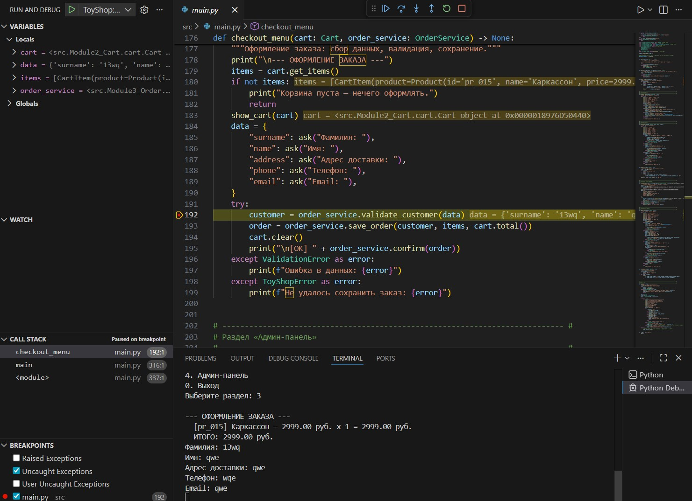
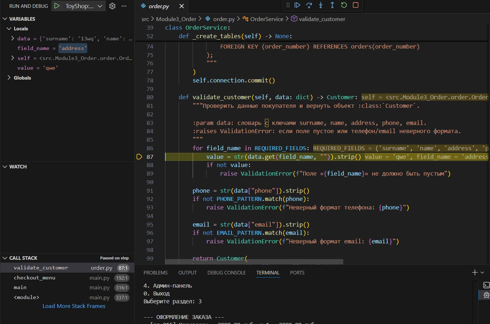

# Отчёт об отладке и логировании — ToyShop

**Проект:** Интернет-магазин игрушек «ToyShop»
**Студент:** Подмарьков Роман Михайлович (вариант 5)
**Среда разработки:** Visual Studio Code, Python 3.14.2

---

## 4.1. Отладка собственного кода

В процессе разработки было допущено и исправлено **три ошибки**. Каждая ошибка
была зафиксирована отдельным коммитом, затем исправление — отдельным коммитом.

### Ошибка №1. Неверный путь к JSON-файлу каталога

- **Описание ошибки.** Путь к файлу каталога был задан как относительный
  (`os.path.join("data", "products.json")`). Программа искала файл относительно
  текущего рабочего каталога, поэтому при запуске тестов из корня проекта файл
  не находился.
- **Как обнаружена.** При запуске `python -m pytest tests/test_catalog.py`
  тест упал с исключением. В логе `logs/app.log` появилась запись уровня ERROR
  со стеком вызовов:
  ```
  FileNotFoundError: [Errno 2] No such file or directory: 'data\products.json'
  ```
- **Решение.** Путь сделан абсолютным и вычисляется относительно расположения
  файла модуля через `os.path.dirname(os.path.abspath(__file__))`.
- **Коммит с ошибкой:** `2a1bc94` — *bug: неверный путь к JSON каталога*.
- **Коммит с исправлением:** `c8c48ee` — *fix: корректный абсолютный путь к JSON через os.path*.

### Ошибка №2. Неверный расчёт суммы корзины

- **Описание ошибки.** Метод `Cart.total()` суммировал только цены товаров
  (`item.product.price`), игнорируя количество. Итоговая сумма заказа была
  занижена при количестве товара больше единицы.
- **Как обнаружена.** Юнит-тест `test_cart.py::test_add_product` (товар 100 ₽
  × 2 шт.) показал расхождение:
  ```
  assert cart.total() == 200.0
  E   assert 100.0 == 200.0
  ```
- **Решение.** В сумму подставлено свойство `item.subtotal`, которое равно
  `цена × количество`.
- **Коммит с ошибкой:** `bfccd1e` — *bug: неверный расчёт суммы корзины без учёта количества*.
- **Коммит с исправлением:** `b05c759` — *fix: учёт количества при расчёте суммы корзины (item.subtotal)*.

### Ошибка №3. Пропуск проверки формата телефона при валидации заказа

- **Описание ошибки.** В методе `OrderService.validate_customer()` была удалена
  проверка формата телефона по регулярному выражению. В базу данных могли
  попасть заказы с некорректным телефоном (например, «123»).
- **Как обнаружена.** Тест `test_order.py::test_validate_rejects_bad_phone`
  завершился сообщением:
  ```
  Failed: DID NOT RAISE ValidationError
  ```
- **Решение.** Восстановлена проверка `if not PHONE_PATTERN.match(phone): raise ValidationError(...)`.
- **Коммит с ошибкой:** `0e6d593` — *bug: пропущена проверка формата телефона*.
- **Коммит с исправлением:** `4d37725` — *fix: восстановлена проверка формата телефона (regex)*.

---

## 4.3. Демонстрация использования инструментов отладки (VS Code)

Для отладки используется конфигурация `.vscode/launch.json` (запуск `src/main.py`).
Работа инструментов отладки показана **двумя скриншотами**, снятыми в среде Visual
Studio Code при реальном прогоне программы.

### Сценарий
Ставим точку останова на вызове валидации заказа, запускаем отладку (**F5**), в меню
выбираем «3. Оформить заказ» и вводим данные покупателя. На точке останова
программа приостанавливается, после чего выполняется заход внутрь метода валидации.

**Скриншот 1 — остановка на точке останова.** Снимок окна VS Code в момент, когда
выполнение остановилось на строке `validate_customer(data)` (`main.py`, строка 192).
На нём одновременно видны:

- **точка останова** — красная точка слева от строки `validate_customer(data)`
  (а также список активных точек в панели **Breakpoints**);
- **просмотр переменных** — панель **Variables → Locals** с текущими значениями
  (`cart`, `data = {'surname': '13wq', ...}`, `items`, `order_service`);
- **анализ стека вызовов** — панель **Call Stack** (Paused on breakpoint) с цепочкой
  вызовов `checkout_menu → main → <module>`;
- панель **Watch** — окно наблюдения за выражениями (доступно для добавления выражений
  кнопкой «+»);
- в нижней части — терминал с выводом программы и введёнными данными покупателя.



**Скриншот 2 — пошаговое выполнение (Step Into).** После нажатия **F11** (Step Into)
отладчик вошёл внутрь метода `OrderService.validate_customer` (файл `order.py`,
строка 87). Жёлтый указатель текущей строки находится уже внутри метода, а панель
**Call Stack** (Paused on step) показывает, что стек углубился:
`validate_customer → checkout_menu → main → <module>`. В панели **Variables** видны
локальные переменные метода (`data`, `field_name = 'address'`, `value = 'qwe'`). Это
демонстрирует пошаговое выполнение с заходом в методы.



Таким образом два скриншота демонстрируют инструменты отладки VS Code: **точку
останова**, **просмотр переменных** (Variables), **анализ стека вызовов** (Call Stack)
и **пошаговое выполнение** (Step Into), а также доступную панель наблюдения **Watch**.

---

## 4.4. Логирование

### Как настроено
Логирование реализовано в модуле `src/common/logger.py` (функция `get_logger`).

- **Куда пишется:** файл `logs/app.log` (кодировка UTF-8).
- **Формат записи:** `%(asctime)s | %(levelname)s | %(message)s`,
  дата — `%Y-%m-%d %H:%M:%S`.
- **Уровни:** `INFO` — обычные события, `ERROR` — ошибки (записываются вместе
  со стеком вызовов через `exc_info=True`).

### Точки логирования
| Событие | Модуль | Уровень |
|---------|--------|---------|
| Загрузка каталога из JSON | `catalog.py` | INFO / ERROR |
| Добавление / удаление / изменение товара в корзине | `cart.py` | INFO |
| Сохранение заказа в БД | `order.py` | INFO / ERROR |
| Изменение статуса заказа | `order.py` | INFO |
| CRUD товаров в админке | `admin.py` | INFO |
| Запуск и завершение приложения, непредвиденные ошибки | `main.py` | INFO / ERROR |

### Пример содержимого файла `logs/app.log`
```
2026-06-18 14:17:25 | INFO | Запуск приложения ToyShop
2026-06-18 14:17:25 | INFO | Каталог загружен: 16 товаров из C:\Users\NRx\Desktop\ekz_project\src\data\products.json
2026-06-18 14:17:25 | INFO | В корзину добавлен товар pr_001 (x2)
2026-06-18 14:17:25 | INFO | Заказ ORD-20260618-0001 сохранён в БД, сумма 9998.00
2026-06-18 14:17:25 | INFO | Корзина очищена
2026-06-18 14:17:25 | INFO | Завершение работы приложения
```

### Пример записи ошибки со стеком вызовов
```
2026-06-18 14:10:02 | ERROR | Файл каталога не найден: data\products.json
Traceback (most recent call last):
  File "...\src\Module1_Catalog\catalog.py", line 49, in load_products
    with open(self.json_path, "r", encoding="utf-8") as file:
FileNotFoundError: [Errno 2] No such file or directory: 'data\products.json'
```

**Вывод.** Система логирования фиксирует все ключевые события и ошибки, что
позволило быстро обнаружить и устранить дефекты (см. раздел 4.1).
